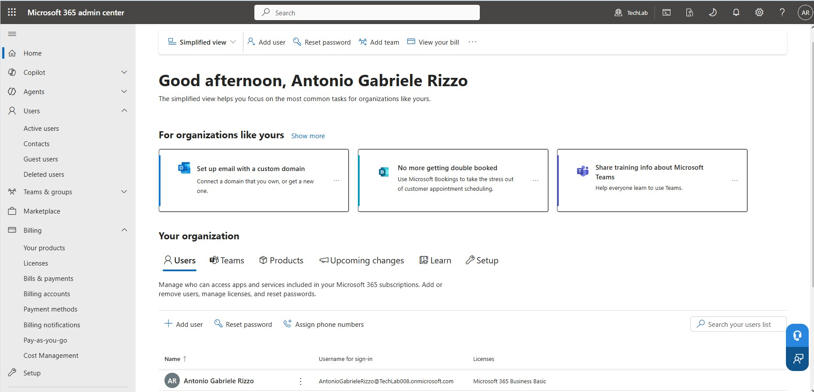
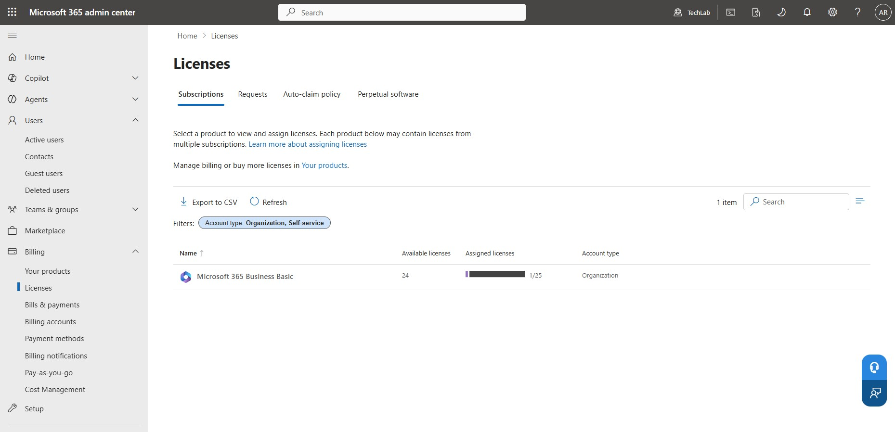
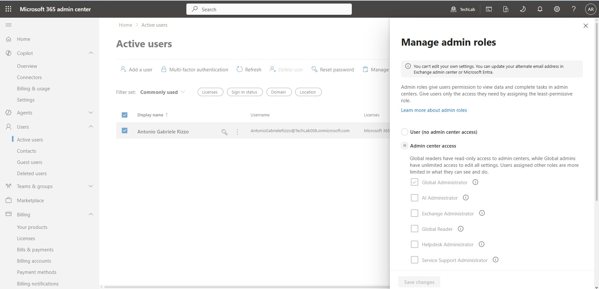

# Tenant Setup – TechLab Microsoft 365

## Objective
To document the initial setup and configuration of the Microsoft 365 tenant **TechLab**, and understand the Microsoft 365 Admin Center.

---

## Environment
- Tenant Name: TechLab  
- Subscription: Microsoft 365 Business Basic  
- Platform: Microsoft 365 Admin Center  

---

## 🛠️ Tasks Performed

### 1. Accessed Microsoft 365 Admin Center
Logged in and reviewed the main dashboard.

### 2. Reviewed Active Users
Checked the default admin account and tenant structure.

### 3. Reviewed Licenses
Examined available Microsoft 365 Business Basic licenses.

### 4. Explored Admin Roles
Reviewed role hierarchy (Global Admin, User Admin, etc.).

---

## Key Learnings
- The Microsoft 365 Admin Center is the central management portal.
- Users require assigned licenses to access services.
- Admin roles control permissions across the tenant.
- Even small tenants replicate real enterprise structure.

---

## Screenshots

### Microsoft 365 Admin Center Home
Overview of the TechLab tenant dashboard after login.

---

### Active Users
User management section showing available accounts in the tenant.

---

### Licenses
Overview of Microsoft 365 Business Basic licenses assigned to the tenant.

---

### Admin Roles
List of administrative roles available in the tenant (e.g., Global Administrator, User Administrator).

---

## Next Step
### User Management
Creating, editing, and managing user accounts in the TechLab Microsoft 365 tenant.
