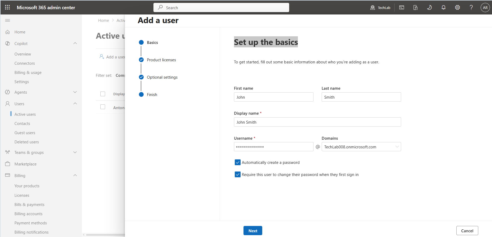
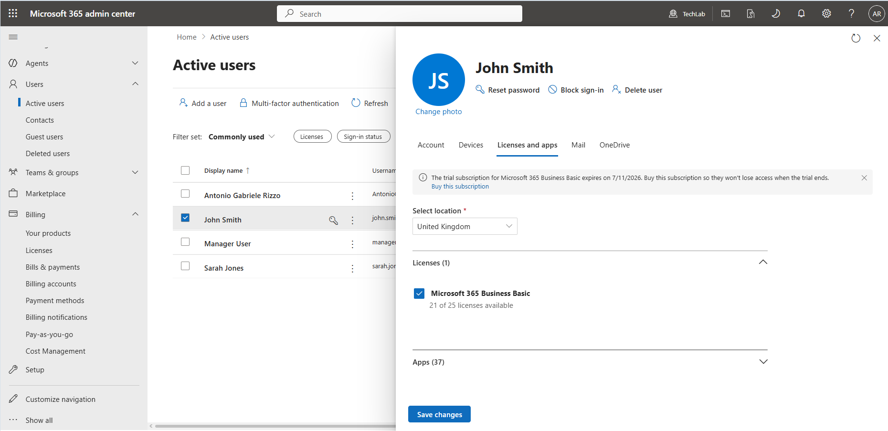
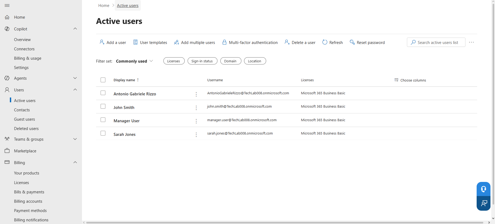

# User Management – TechLab Microsoft 365

## Objective

To create and manage user accounts within Microsoft 365 and understand the user lifecycle from creation to administration.

---

## Environment

- Tenant: TechLab
- Default Domain: techlab008.onmicrosoft.com
- Platform: Microsoft 365 Admin Center
- Subscription: Microsoft 365 Business Basic

---

## Scenario

A small company environment was simulated using users from different departments.

The following users were created for administration and support exercises.

| User | Department |
|--------|--------|
| John Smith | Sales |
| Sarah Jones | Operations |
| Manager User | Management |

---

## Tasks Performed

### 1. Created User Accounts

Created user accounts through the Microsoft 365 Admin Center using the user creation wizard.

Evidence:

---

### 2. Verified User Creation

Confirmed successful account creation through the Microsoft 365 Admin Center.

Evidence:

---

### 3. Assigned Microsoft 365 Licences

Assigned Microsoft 365 Business Basic licences to the newly created users.

Licence assignment enables access to Microsoft 365 services such as:

- Outlook
- Microsoft Teams
- OneDrive
- SharePoint

Evidence:

---

### 4. Verified Active Users

Confirmed that all newly created accounts appear in the Active Users list and are available for administration.

Evidence:

---

## Key Learnings

- User creation is a fundamental Microsoft 365 administration task.
- Microsoft 365 licences are required before users can access cloud services.
- The Active Users page is the primary location for managing user accounts.
- Proper user onboarding includes account creation and licence assignment.
- Microsoft 365 provides centralized identity management.

---

## Skills Demonstrated

- User account creation
- Licence assignment
- Microsoft 365 Admin Center navigation
- Identity management fundamentals
- Administrative verification procedures
- Technical documentation using GitHub and Markdown

---

## Next Tasks

The following user administration tasks will be completed as part of this project:

- Password reset
- Block sign-in
- Delete user
- Restore deleted user
