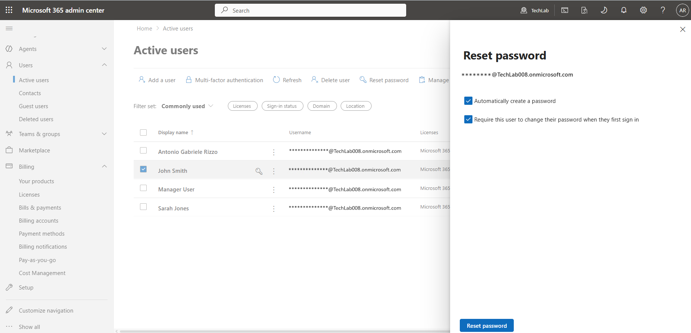
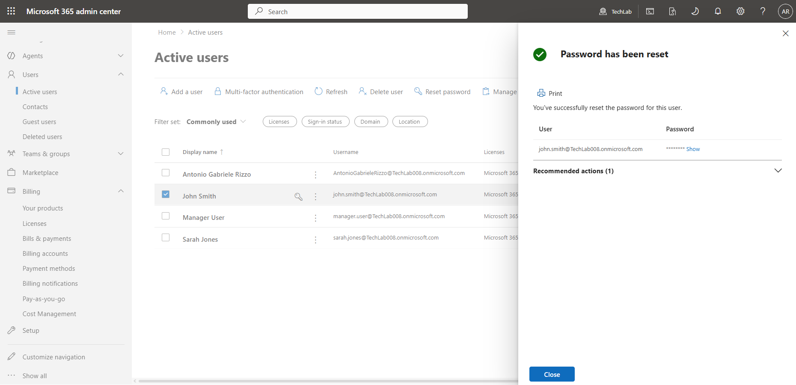
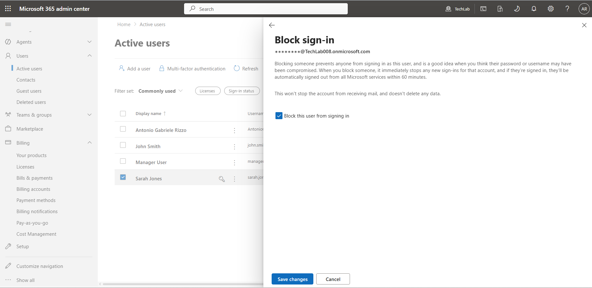
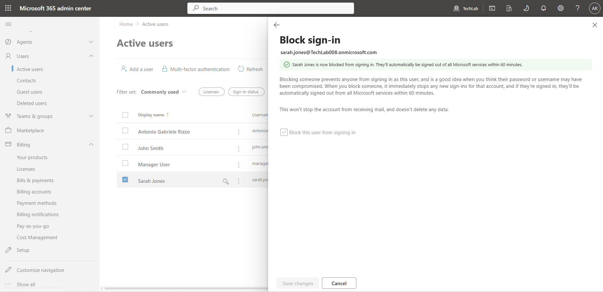
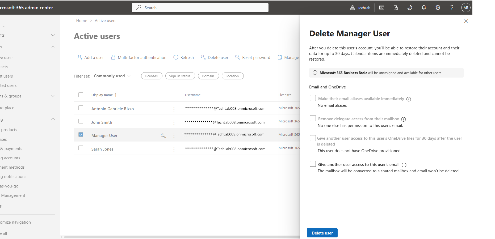
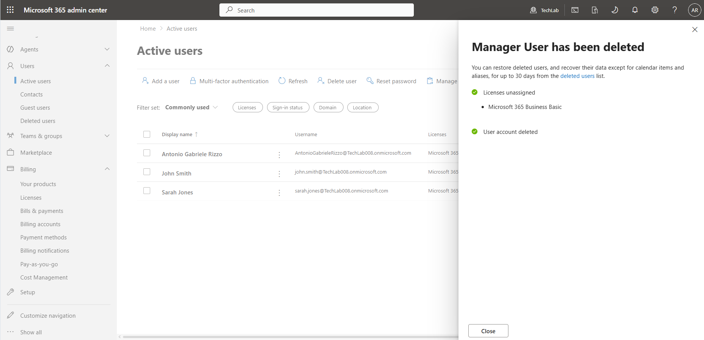
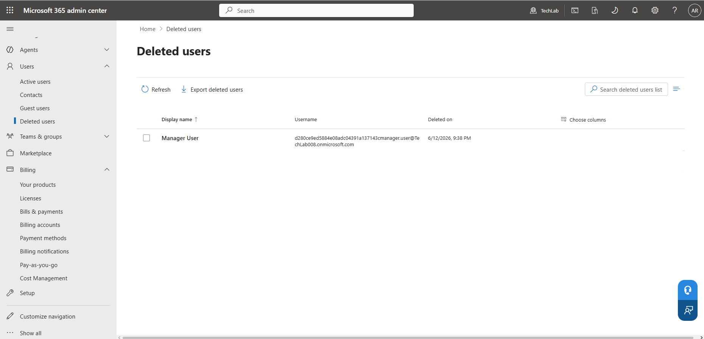
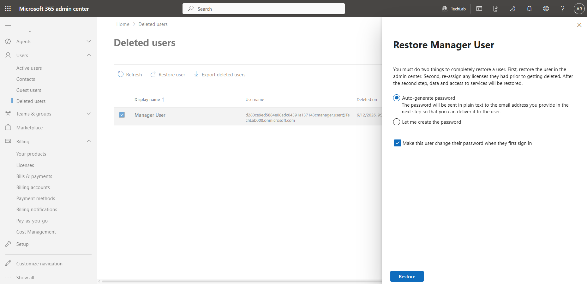
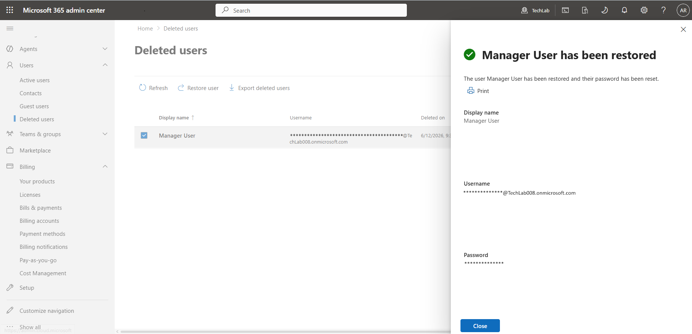
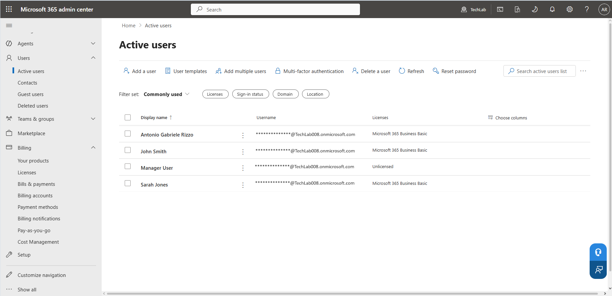

# User Management – TechLab Microsoft 365

## Objective

To understand and perform the core user administration tasks required in Microsoft 365 environments.

This project focuses on the complete user lifecycle, including account creation, licence assignment, password management, sign-in control, account deletion, and account restoration.

These activities closely reflect the day-to-day responsibilities of IT Support Technicians, Service Desk Analysts, and Microsoft 365 Administrators.

---

## Environment

- Tenant Name: TechLab
- Default Domain: techlab008.onmicrosoft.com
- Subscription: Microsoft 365 Business Basic
- Platform: Microsoft 365 Admin Center

---

## Overview

User management is one of the most important responsibilities in Microsoft 365 administration.

Every Microsoft 365 service relies on user identities. Before users can access applications such as Outlook, Teams, OneDrive, or SharePoint, administrators must create and manage their accounts.

Microsoft 365 provides centralized identity management through the Admin Center, allowing administrators to manage user access, licences, passwords, and account status from a single interface.

---

## Why User Management Matters

Effective user management helps organisations:

- Provide access to business applications and services
- Protect company data
- Manage employee onboarding and offboarding
- Maintain security and compliance
- Resolve common user access issues

Many IT support tickets involve user account administration, making these skills essential for Microsoft 365 administrators and Service Desk personnel.

---

## Users Created

A small company environment was simulated using the following user accounts.

| User | Department |
|--------|--------|
| John Smith | Sales |
| Sarah Jones | Operations |
| Manager User | Management |

---

## Tasks Performed

### 1. Created User Accounts

User accounts were created using the Microsoft 365 Admin Center.

During account creation, the following information was configured:

- First name
- Last name
- Display name
- Username (User Principal Name)

Evidence:

---

### 2. Verified User Creation

After creation, Microsoft 365 confirmed that the user accounts had been successfully added to the tenant.

Evidence:

---

### 3. Assigned Microsoft 365 Licences

Microsoft 365 licences determine which services users can access.

A Microsoft 365 Business Basic licence was assigned to the users to provide access to services such as:

- Outlook
- Microsoft Teams
- OneDrive
- SharePoint

Without a licence, users cannot access Microsoft 365 services.

Evidence:

---

### 4. Verified Active Users

The Active Users page was used to verify that all user accounts were successfully created and available for administration.

Evidence:

---

### 5. Performed Password Reset

A password reset was performed for John Smith.

Password resets are among the most common tasks performed by IT Service Desk teams.

During the reset process:

- A temporary password was generated
- The user was required to change the password at next sign-in

This helps maintain account security while restoring user access.

Evidence:

---

### 6. Blocked User Sign-In

A sign-in block was applied to Sarah Jones.

Blocking sign-in prevents a user from accessing Microsoft 365 services without deleting the account.

This feature is commonly used when:

- Investigating security concerns
- Suspending access temporarily
- Managing employee departures

Evidence:

---

### 7. Deleted User Account

The Manager User account was deleted.

When a user is deleted in Microsoft 365, the account is moved to the Deleted Users container rather than being permanently removed immediately.

This provides a recovery period if the deletion was accidental.

Evidence:

---

### 8. Restored Deleted User

The previously deleted Manager User account was restored.

The restoration process demonstrates Microsoft's built-in protection against accidental account removal.

After restoration, the account returned to the Active Users list and became available for administration again.

Evidence:

---

## Key Learnings

- User accounts form the foundation of Microsoft 365 identity management.
- Microsoft 365 licences are required before users can access services.
- Password resets are a common IT support activity.
- Sign-in blocking allows administrators to suspend access without deleting accounts.
- Deleted users are retained temporarily and can be restored.
- Microsoft 365 includes built-in protection against accidental account deletion.
- The Active Users page serves as the primary location for user administration.

---

## Skills Demonstrated

- User account creation
- Licence assignment
- Password administration
- User access management
- Account suspension
- User deletion and restoration
- Microsoft 365 Admin Center navigation
- Identity and Access Management (IAM) fundamentals
- Technical documentation using GitHub and Markdown

---

## Summary

This project introduced the complete user lifecycle within Microsoft 365.

By creating users, assigning licences, resetting passwords, blocking sign-in, deleting accounts, and restoring deleted users, I gained practical experience with the most common administrative tasks performed in Microsoft 365 environments.

These activities closely reflect the responsibilities of IT Support Technicians, Service Desk Analysts, and Microsoft 365 Administrators.

---

## Next Project

### Groups

The next project focuses on:

- Microsoft 365 Groups
- Security Groups
- Distribution Lists
- Group ownership
- Membership management

These group types provide different methods for managing permissions, communication, and collaboration within Microsoft 365.
