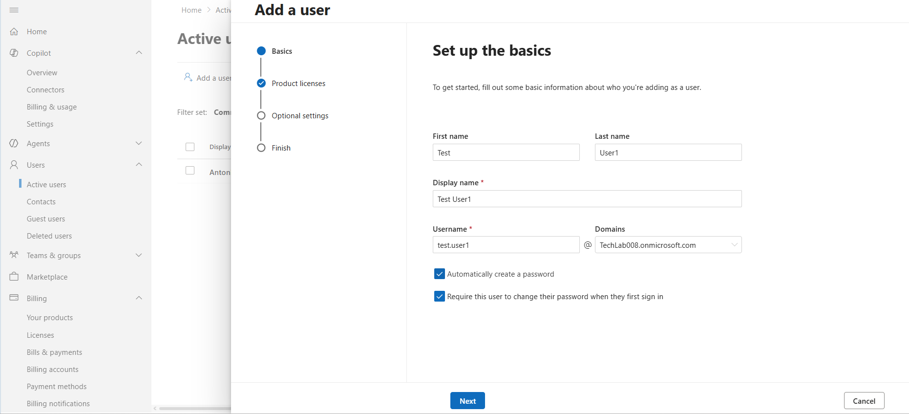
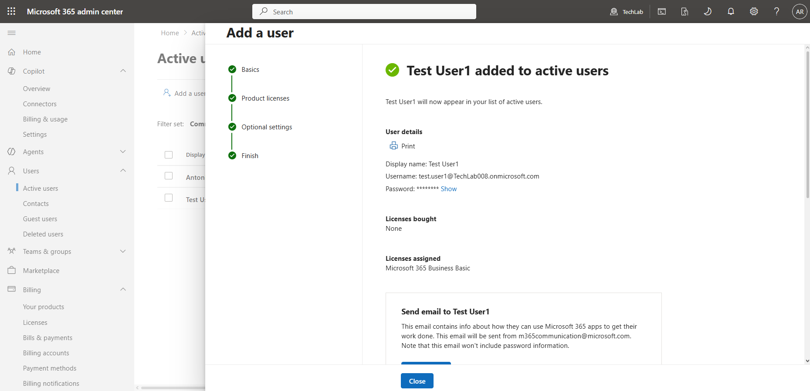
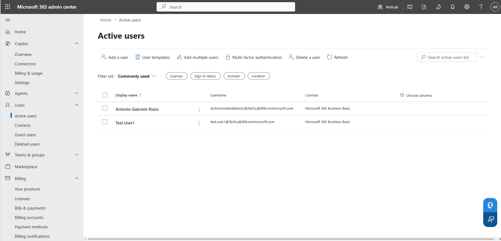

# User Management – TechLab Microsoft 365

## Objective
To create and manage user accounts in the Microsoft 365 TechLab tenant, simulating real IT Service Desk onboarding tasks.

---

## Environment
- Tenant: TechLab008 (TechLab)
- Platform: Microsoft 365 Admin Center
- Service: Microsoft 365 Business Basic

---

## Tasks Performed

### 1. Created a New User
A test user was created using the Microsoft 365 Admin Center.

- Name: Test User1  
- Username: test.user1@techlab008.onmicrosoft.com  

---

### 2. User Setup (Basics)
Configured user identity details during creation:
- First name
- Last name
- Display name
- Username (UPN)

📸 Evidence:

---

### 3. Account Creation Confirmation
The system confirmed successful creation of the user account.

📸 Evidence:

---

### 4. Verified User in Active Users
Confirmed that the new user appears in the Active Users list.

📸 Evidence:

---

## Key Learnings
- User creation is a core IT support responsibility.
- User Principal Name (UPN) must match tenant domain.
- Active Users page is the system of record for account validation.
- Microsoft 365 enforces structured onboarding workflows.

---

## Notes
- Screenshots were captured in PNG format for better clarity.
- All images are stored in the `/screenshots` folder within this project.

---

## Next Step
Password Reset & Account Management (Helpdesk Simulation)
