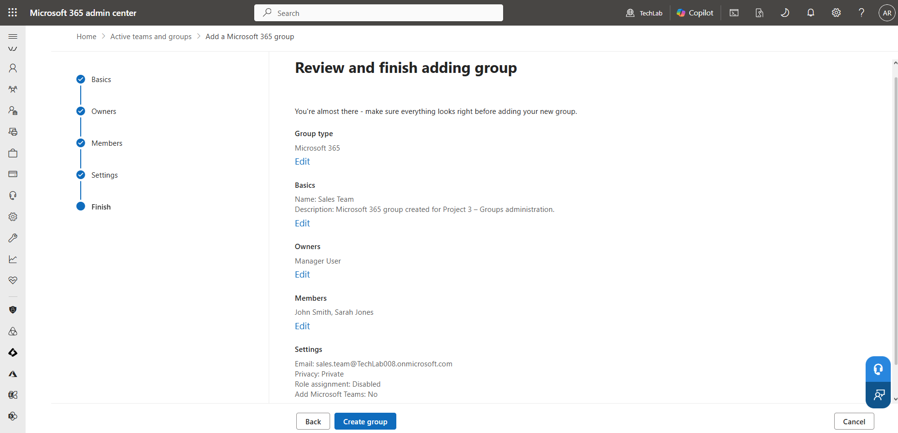
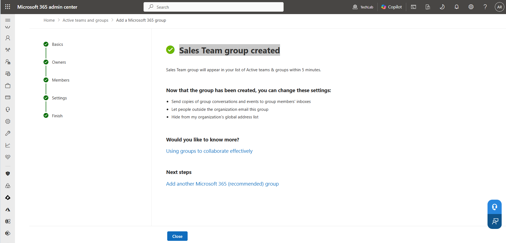
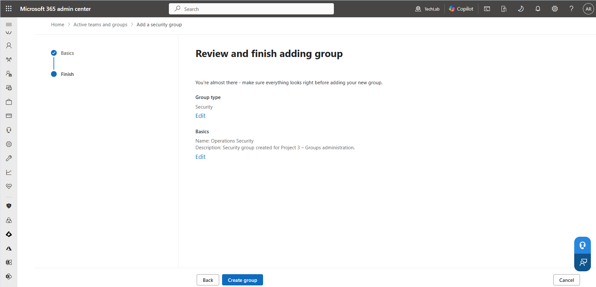
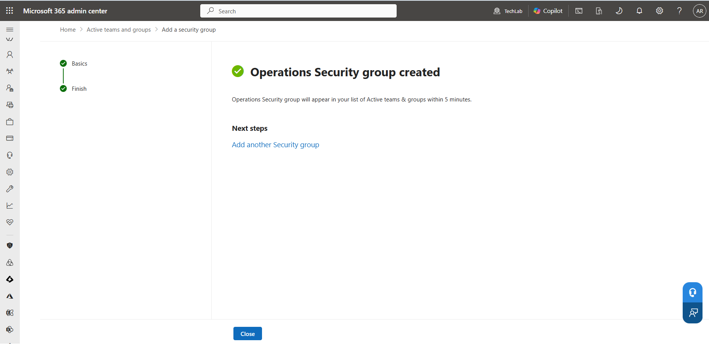
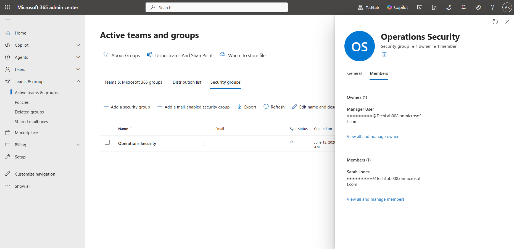
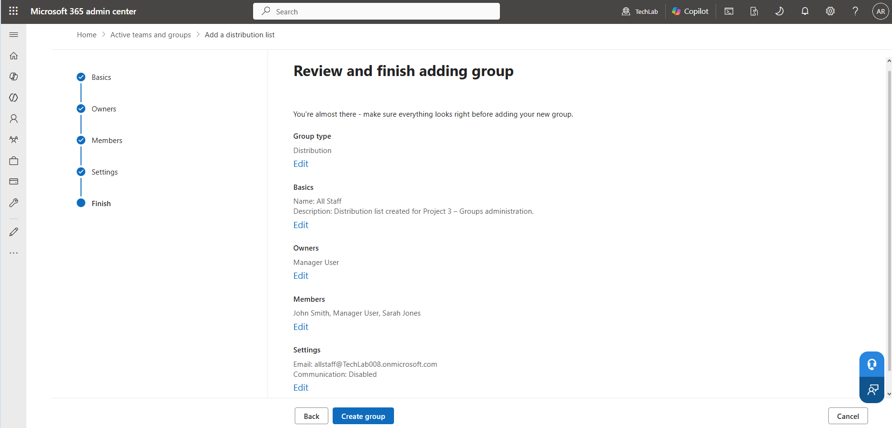
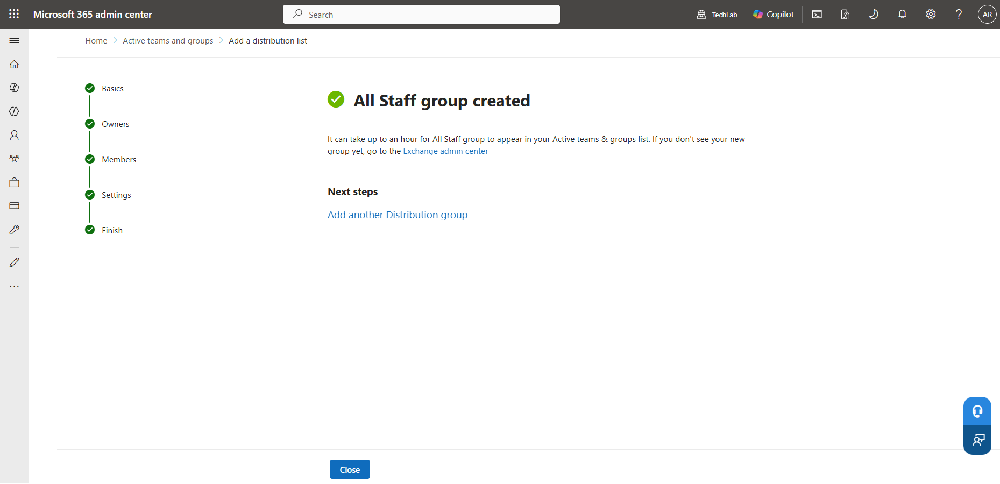
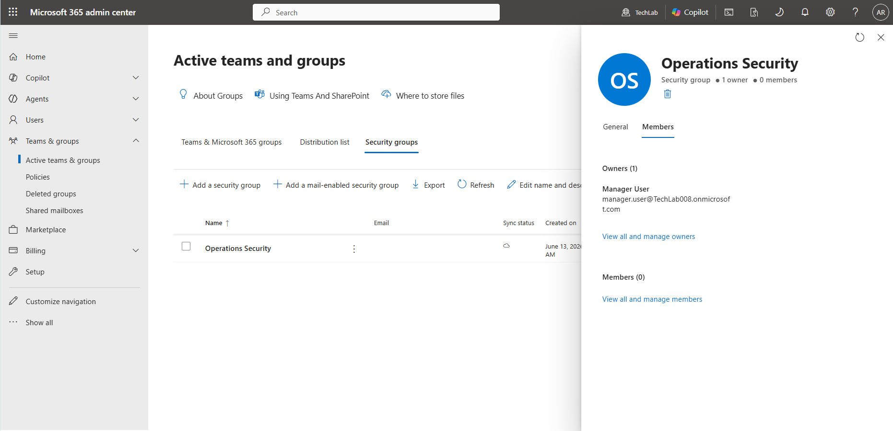
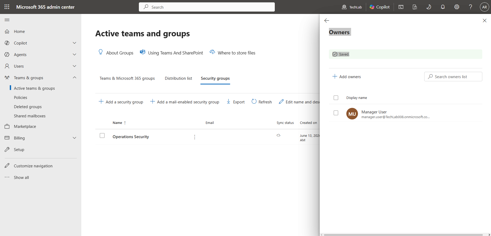
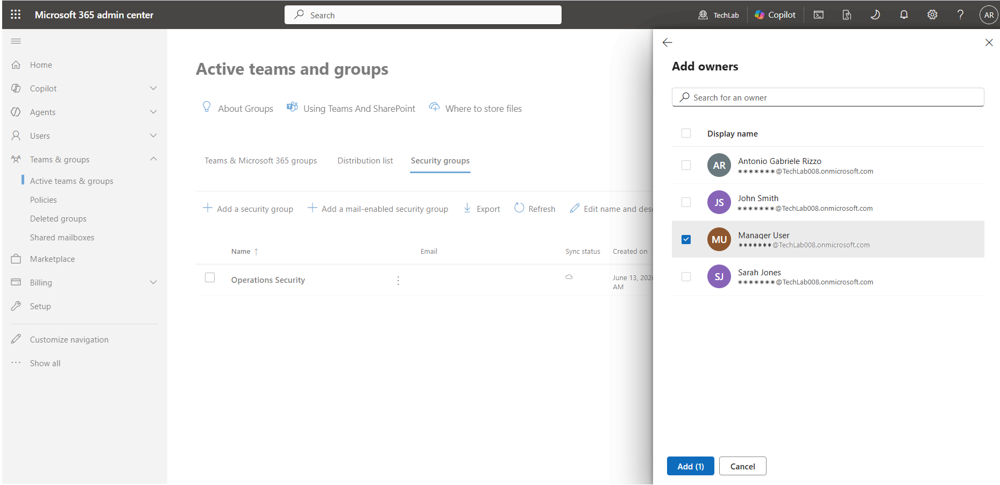

# Groups – TechLab Microsoft 365

## Objective

To understand how different group types are used within Microsoft 365 and gain practical experience creating and managing Microsoft 365 Groups, Security Groups, and Distribution Lists.

This project focuses on group ownership, membership management, collaboration, communication, and access control.

These activities closely reflect the responsibilities of Microsoft 365 Administrators, IT Support Technicians, and Identity and Access Management (IAM) professionals.

---

## Environment

- Tenant Name: TechLab
- Default Domain: techlab008.onmicrosoft.com
- Subscription: Microsoft 365 Business Basic
- Platform: Microsoft 365 Admin Center

---

## Overview

Groups allow administrators to manage multiple users as a single unit.

Rather than assigning permissions, collaboration resources, or communication settings to individual users, administrators can manage groups and their memberships.

Microsoft 365 provides several group types, each designed for a specific purpose.

The group types explored in this project were:

- Microsoft 365 Groups
- Security Groups
- Distribution Lists

Understanding the differences between these group types is an important Microsoft 365 administration skill.

---

## Why Groups Matter

Groups help organisations:

- Simplify administration
- Improve collaboration
- Control access to resources
- Manage communication efficiently
- Reduce administrative overhead

As organisations grow, managing users individually becomes increasingly difficult. Groups provide a scalable way to manage users and services.

---

## Tasks Performed

### 1. Created a Microsoft 365 Group

A Microsoft 365 Group named **Sales Team** was created.

Microsoft 365 Groups are designed for collaboration and provide shared resources such as:

- Shared mailbox
- Shared calendar
- SharePoint integration
- Microsoft Teams integration
- Group conversations

The group was configured with:

- Group Name: Sales Team
- Owner: Manager User
- Members: John Smith, Sarah Jones
- Privacy: Private

The group was configured as **Private** to simulate a typical business department where access to conversations, files, and collaboration resources should be restricted to authorised members.

Evidence:

---

### 2. Created a Security Group

A Security Group named **Operations Security** was created.

Security Groups are primarily used to manage permissions and access control.

Unlike Microsoft 365 Groups, Security Groups do not provide collaboration resources such as shared mailboxes or SharePoint sites.

The group was configured with:

- Group Name: Operations Security
- Owner: Manager User
- Member: Sarah Jones

Evidence:

---

### 3. Created a Distribution List

A Distribution List named **All Staff** was created.

Distribution Lists are used to simplify email communication by allowing a single email address to deliver messages to multiple recipients.

The group was configured with:

- Group Name: All Staff
- Owner: Manager User
- Members:
  - John Smith
  - Sarah Jones
  - Manager User

Evidence:

---

### 4. Managed Group Ownership

Group ownership was reviewed and configured.

Group owners are responsible for:

- Managing membership
- Maintaining group settings
- Managing group resources
- Reviewing access requirements

During the project, Manager User was assigned as the owner of the created groups.

Evidence:

---

### 5. Managed Group Membership

Membership management was performed by adding and reviewing members within the groups.

Membership management allows administrators and group owners to:

- Add users
- Remove users
- Control access to resources
- Maintain collaboration and communication groups

Evidence:

---

## Troubleshooting and Observations

During the project, two useful administrative observations were made.

### Licensing and Group Availability

Manager User could not initially be selected as a Distribution List owner or member.

Investigation revealed that the user account did not have a Microsoft 365 licence assigned.

After assigning a Microsoft 365 Business Basic licence, the account became available for selection.

This demonstrated the relationship between user licensing and Microsoft 365 services.

---

### Distribution List Creation Error

During the first attempt to create the Distribution List, the Microsoft 365 Admin Center displayed an error message.

Verification showed that the Distribution List had actually been created successfully.

The group was deleted and recreated to repeat the process and capture the required screenshots.

This reinforced an important administration principle:

**Always verify the result of an administrative action rather than relying solely on system messages.**

---

## Group Type Comparison

| Group Type | Primary Purpose |
|------------|------------------|
| Microsoft 365 Group | Collaboration |
| Security Group | Permissions and Access Control |
| Distribution List | Email Communication |

---

## Key Learnings

- Microsoft 365 provides multiple group types designed for different business requirements.
- Microsoft 365 Groups support collaboration through shared resources.
- Security Groups are used primarily for permissions and access management.
- Distribution Lists simplify email communication.
- Group ownership helps maintain accountability and administration.
- Membership management controls access to resources and communication channels.
- User licensing can affect service availability within Microsoft 365.
- Administrative actions should always be verified after completion.

---

## Skills Demonstrated

- Microsoft 365 Group administration
- Security Group administration
- Distribution List administration
- Group ownership management
- Membership management
- Identity and Access Management (IAM) fundamentals
- Troubleshooting Microsoft 365 administration issues
- Microsoft 365 Admin Center navigation
- Technical documentation using GitHub and Markdown

---

## Summary

This project introduced the major group types available within Microsoft 365 and demonstrated how they are used to support collaboration, communication, and access control.

By creating Microsoft 365 Groups, Security Groups, and Distribution Lists, as well as managing ownership and membership, I gained practical experience with a key area of Microsoft 365 administration.

---

## Next Project

### Exchange Online

The next project focuses on:

- Shared mailboxes
- Mail aliases
- Automatic replies
- Mail flow basics
- Exchange administration fundamentals

These tasks will provide hands-on experience with Microsoft 365 email administration using Exchange Online.
