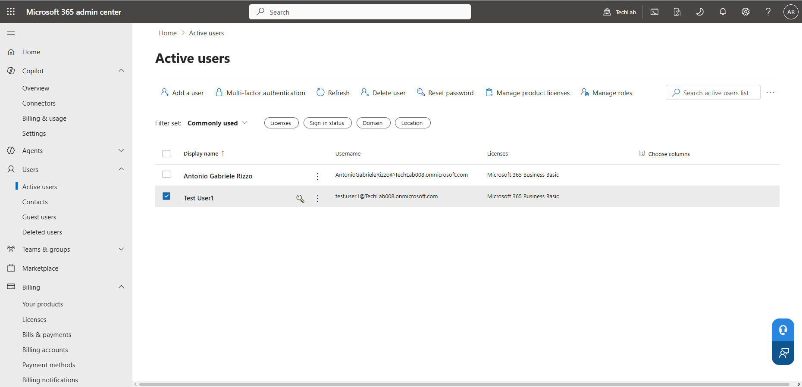
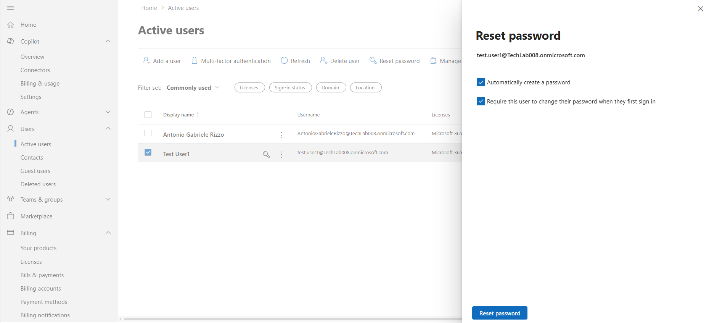
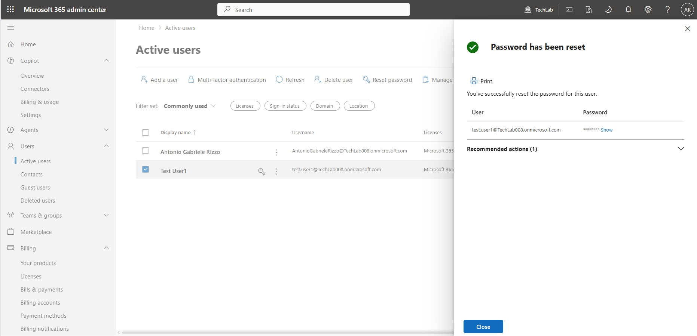

# Helpdesk Simulation – Password Reset

## Objective

To simulate a common IT Service Desk request by resetting a user's password in Microsoft 365 Admin Center.

---

## Ticket Scenario

A user reported being unable to access their Microsoft 365 account due to a forgotten password.

---

## Actions Performed

### 1. Located User Account

Accessed:

Users → Active users

Selected the affected user account.

### 2. Reset Password

Used the Reset Password function to generate a new temporary password.

Configured the account to require a password change at the next sign-in.

### 3. Verified Completion

Confirmed successful password reset through the Microsoft 365 Admin Center.

---

## Screenshots

### User Selected

---

### Password Reset Window

---

### Password Reset Confirmation

---

## Key Learnings

- Password resets are one of the most common Service Desk tasks.
- Administrators can force users to change passwords at next sign-in.
- Microsoft 365 provides built-in account recovery tools.
- Proper verification is required before completing support requests.

---

## Resolution

The user's password was successfully reset and the account was ready for sign-in using the temporary credentials.
