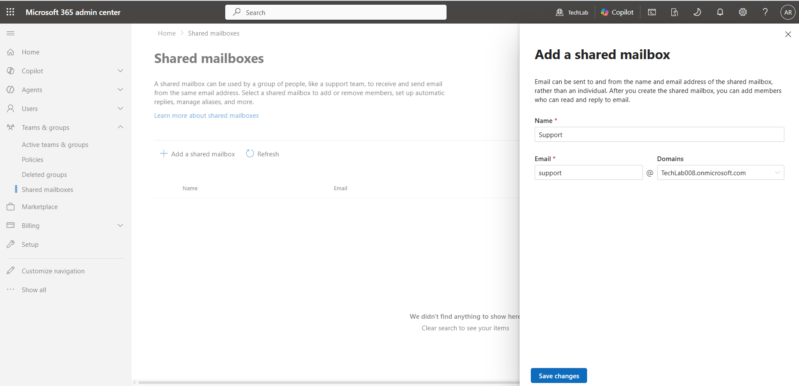
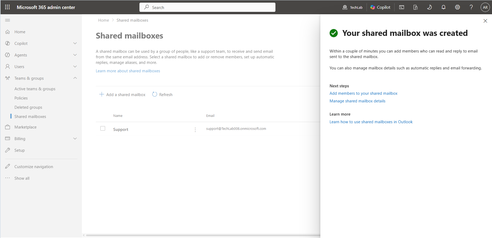
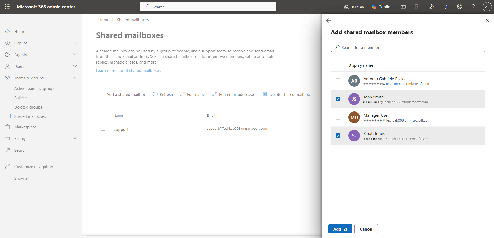
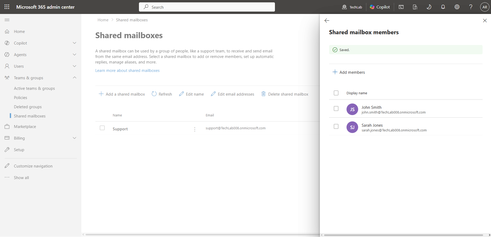
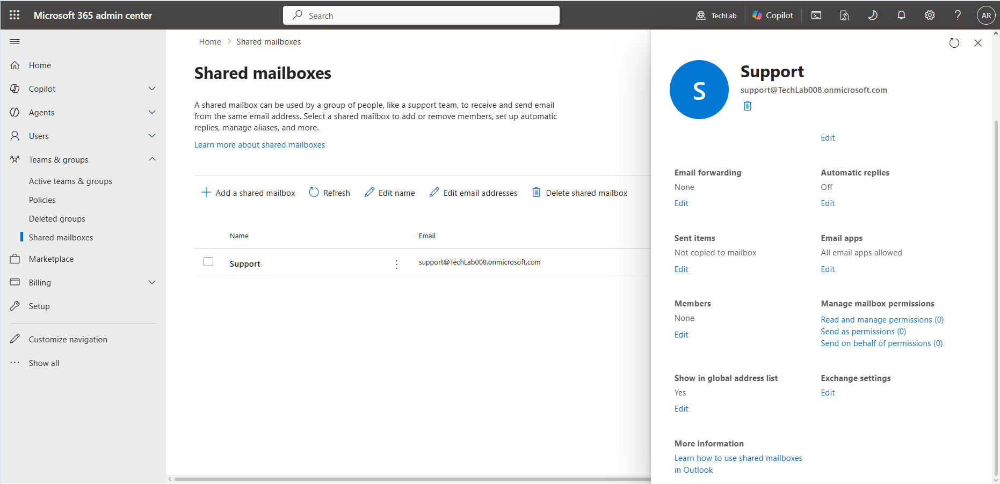
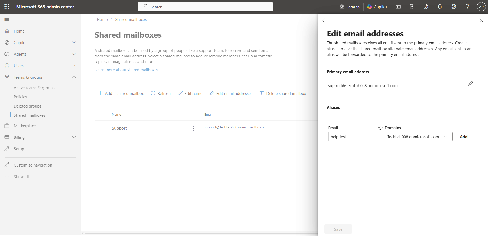
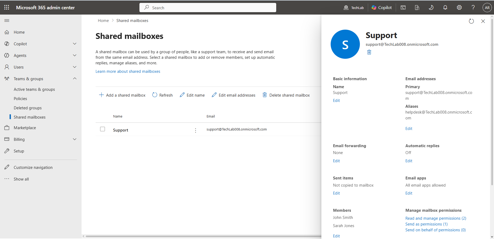
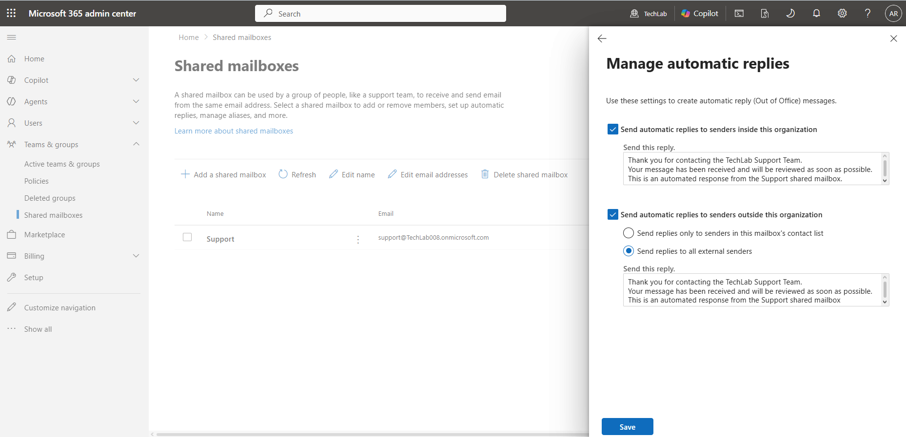
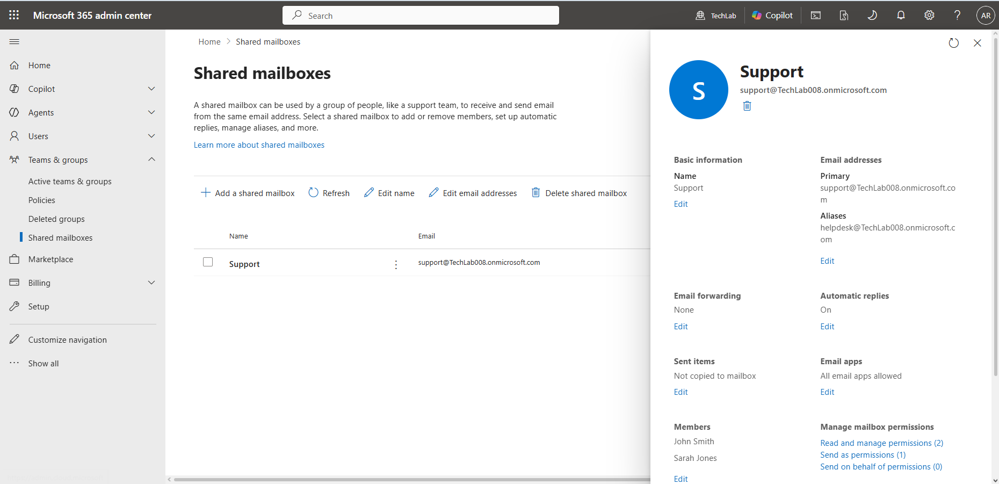

# Exchange Online – TechLab Microsoft 365

## Objective

To gain practical experience with Exchange Online administration by creating and managing a Shared Mailbox, assigning mailbox members, configuring email aliases, enabling automatic replies, and understanding basic mail flow concepts.

These activities simulate common tasks performed by Microsoft 365 Administrators, IT Support Technicians, and Service Desk Analysts.

---

## Environment

- Tenant Name: TechLab
- Default Domain: techlab008.onmicrosoft.com
- Subscription: Microsoft 365 Business Basic
- Platform: Microsoft 365 Admin Center
- Service: Exchange Online

---

## Overview

Exchange Online is Microsoft's cloud-based email and calendaring service.

It provides organisations with:

- Business email
- Shared mailboxes
- Calendars
- Contact management
- Email routing
- Mail flow controls

Exchange Online is one of the most widely used Microsoft 365 services and forms a key part of many IT support and administration roles.

---

## Why Exchange Online Matters

Email remains one of the most important communication tools within organisations.

Microsoft 365 administrators are commonly responsible for:

- Creating and managing mailboxes
- Assigning mailbox permissions
- Managing email addresses and aliases
- Configuring automatic replies
- Troubleshooting mail delivery issues
- Supporting users with Outlook and Exchange-related requests

Understanding Exchange Online fundamentals is therefore an essential Microsoft 365 administration skill.

---

## Tasks Performed

### 1. Created a Shared Mailbox

A Shared Mailbox named **Support** was created.

Shared Mailboxes allow multiple users to access and manage a common mailbox without requiring a dedicated user account.

Common business examples include:

- support@
- helpdesk@
- sales@
- info@
- hr@

The mailbox was configured as:

- Name: Support
- Primary Email Address: support@techlab008.onmicrosoft.com

Evidence:

---

### 2. Assigned Shared Mailbox Members

Mailbox access was granted to:

- John Smith
- Sarah Jones

Assigning members allows authorised users to access and manage the Shared Mailbox.

This enables multiple users to:

- Read incoming messages
- Respond to emails
- Manage mailbox communications

Evidence:

---

### 3. Reviewed Shared Mailbox Configuration

The mailbox configuration page was reviewed to understand the administration options available for Shared Mailboxes.

The page provided access to:

- Email addresses
- Aliases
- Automatic replies
- Mailbox permissions
- Email forwarding settings
- Exchange settings

Evidence:

---

### 4. Configured an Email Alias

An additional email alias was configured for the Shared Mailbox.

Alias created:

- helpdesk@techlab008.onmicrosoft.com

The mailbox now receives email sent to either:

- support@techlab008.onmicrosoft.com
- helpdesk@techlab008.onmicrosoft.com

without requiring a second mailbox.

Evidence:

---

### 5. Configured Automatic Replies

Automatic Replies (Out of Office messages) were enabled for the Shared Mailbox.

The configuration was applied to:

- Internal senders
- External senders

Automatic replies provide immediate acknowledgement that a message has been received.

This is commonly used for:

- Support mailboxes
- Helpdesk mailboxes
- Customer service teams
- Temporary absence notifications

Evidence:

---

### 6. Reviewed Basic Mail Flow Concepts

The configuration completed during this project demonstrates a simple Exchange Online mail flow scenario.

Example:

External Sender  
↓  
helpdesk@techlab008.onmicrosoft.com  
↓  
Support Shared Mailbox  
↓  
John Smith / Sarah Jones  
↓  
Automatic Reply Sent

This demonstrates how Exchange Online routes email from multiple email addresses into a single mailbox while providing automated responses to senders.

---

## Exchange Administration Fundamentals

Throughout this project, several core Exchange Online administration tasks were performed.

These tasks closely resemble activities commonly carried out by Microsoft 365 administrators and IT support professionals.

Skills practiced included:

- Shared Mailbox creation
- Mailbox membership management
- Email alias administration
- Automatic reply configuration
- Mail flow understanding
- Exchange Online administration through the Microsoft 365 Admin Center

These activities provide a solid introduction to Exchange Online administration and email service management.

---

## Key Learnings

- Shared Mailboxes allow multiple users to manage a common email address.
- Mailbox membership controls access to Shared Mailboxes.
- Email aliases provide additional email addresses without creating additional mailboxes.
- Automatic Replies can be configured separately for internal and external users.
- Exchange Online automatically routes messages sent to aliases into the primary mailbox.
- Understanding mail flow is essential when troubleshooting email delivery issues.
- Exchange Online administration is a core component of Microsoft 365 management.

---

## Skills Demonstrated

- Exchange Online administration
- Shared Mailbox management
- Mailbox membership administration
- Email alias management
- Automatic reply configuration
- Mail flow understanding
- Microsoft 365 Admin Center navigation
- Technical documentation using GitHub and Markdown

---

## Summary

This project introduced key Exchange Online administration tasks through the creation and management of a Shared Mailbox.

By configuring mailbox membership, email aliases, automatic replies, and reviewing mail flow concepts, I gained practical experience with common Exchange Online administration activities that are frequently performed in IT support and Microsoft 365 administration roles.

---

## Next Project

### SharePoint

The next project focuses on:

- Team sites
- Document libraries
- Folder structure
- Permissions
- Sharing controls
- Version history

These tasks will introduce SharePoint Online administration and document management within Microsoft 365.
