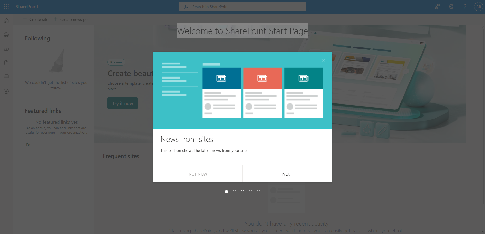
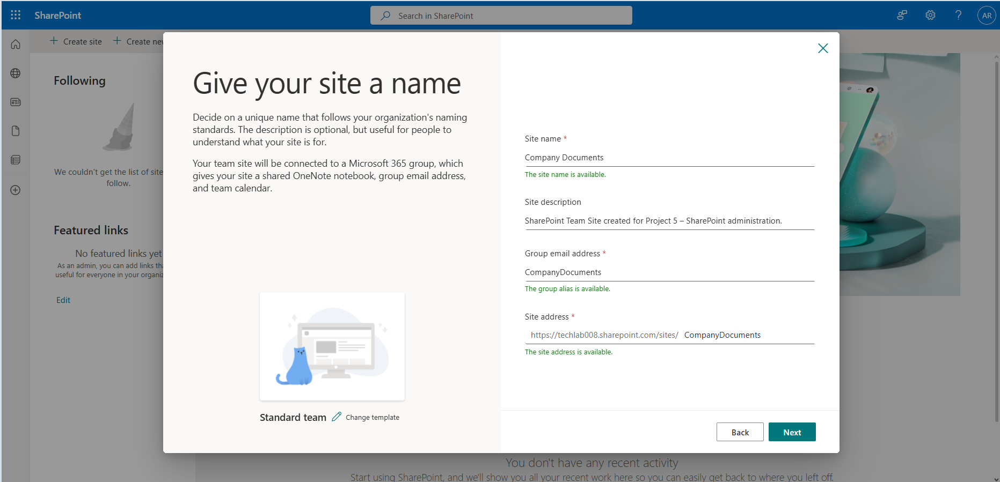
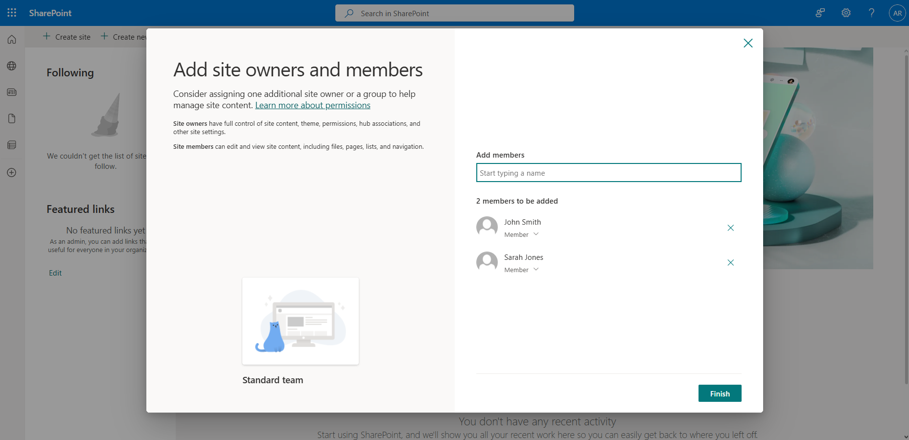
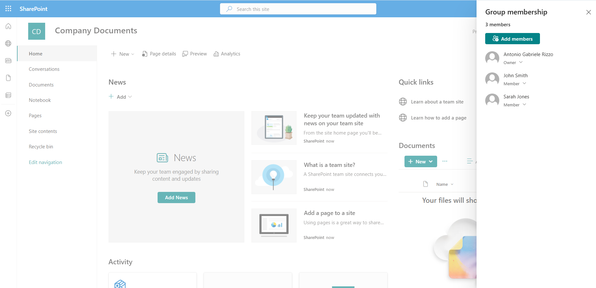
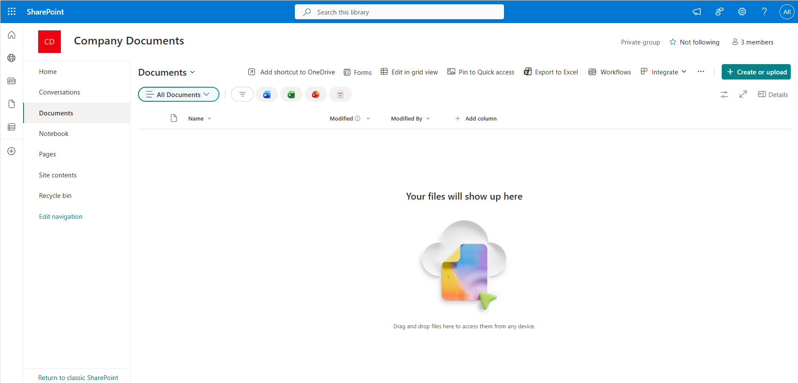
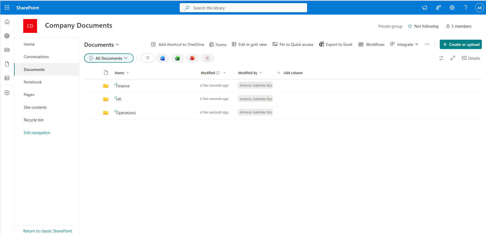
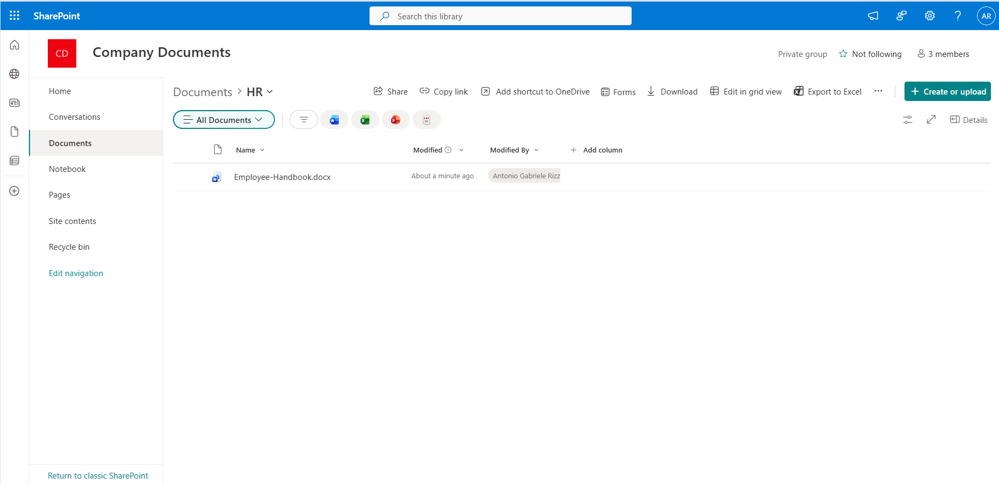
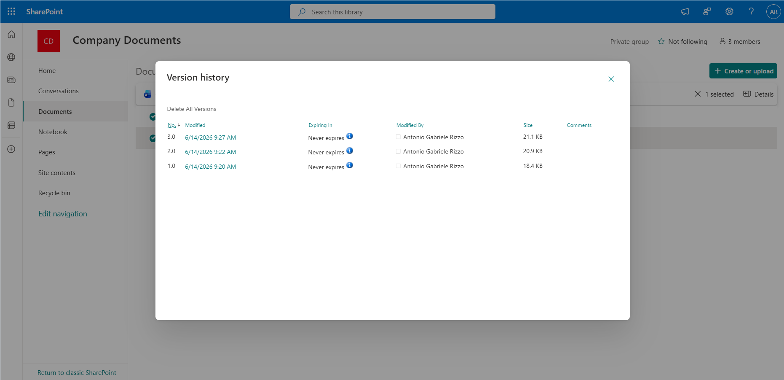
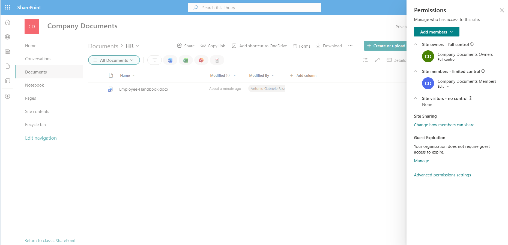

## Accessing SharePoint

Locating SharePoint was not immediately obvious through the Microsoft 365 Admin Center navigation menu.

The most reliable method was:

1. Open Microsoft 365 Admin Center.
2. Use the search bar at the top of the page.
3. Search for **SharePoint**.
4. Open the SharePoint application.

### Screenshot

---

## Creating the Team Site

A Team Site was created using the Standard Team template.

### Configuration

| Setting | Value |
|----------|----------|
| Site Name | Company Documents |
| Description | SharePoint Team Site created for Project 5 – SharePoint administration |
| Privacy | Private |
| Template | Standard Team |

### Screenshot

---

## Site Membership

The following users were added during site creation:

### Members

- John Smith
- Sarah Jones

### Screenshots

---

## Document Library

The default SharePoint Document Library was used to store organisational content.

### Screenshot

---

## Folder Structure

### Screenshot

---

## Document Creation and Storage

### Screenshot

---

## Version History

### Screenshot

---

## Permissions and Sharing Controls

### Screenshot

