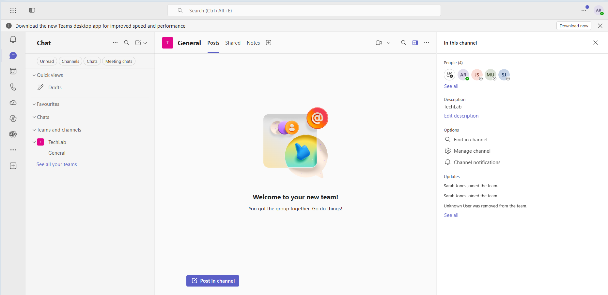
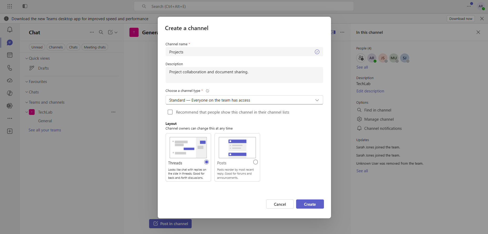
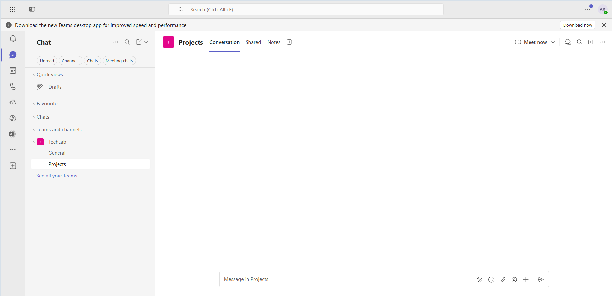
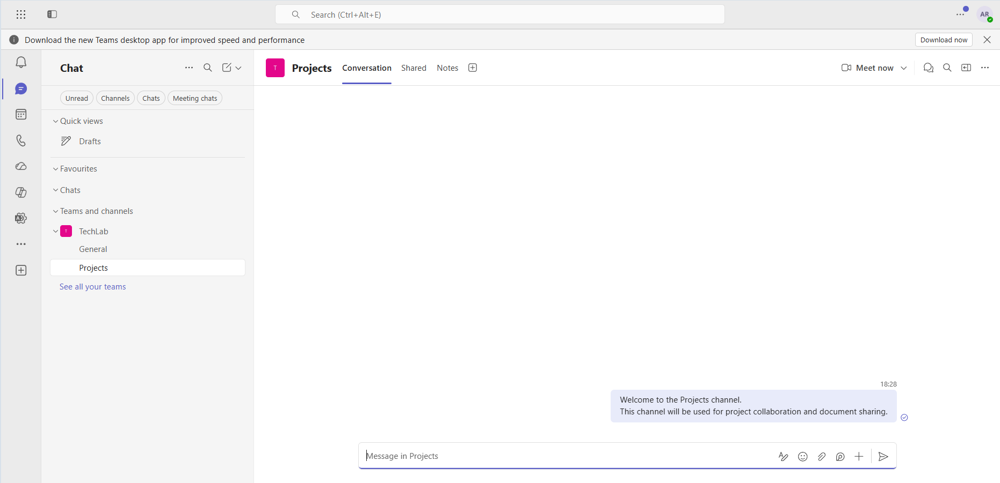
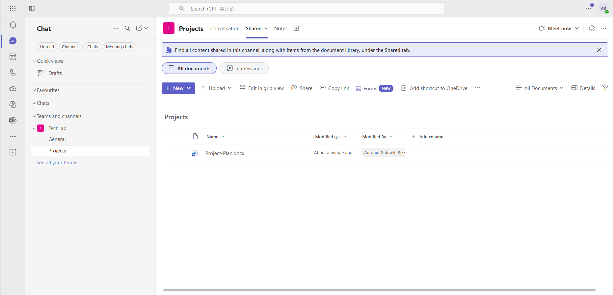
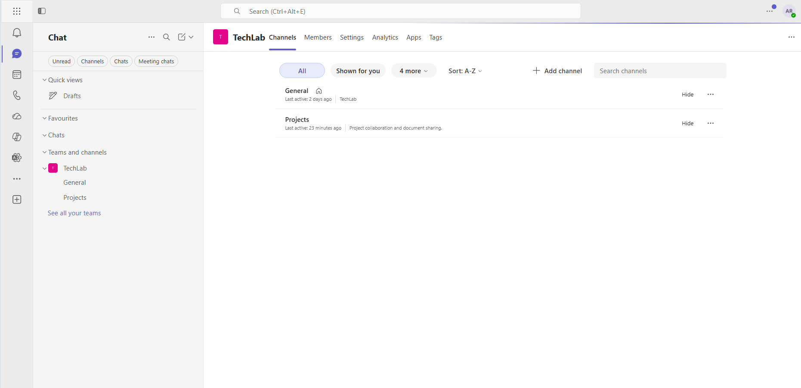
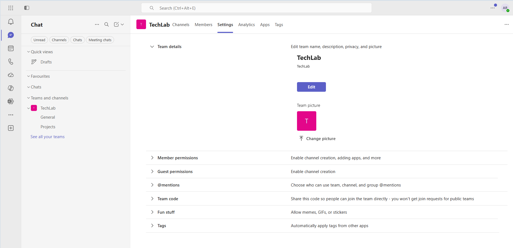
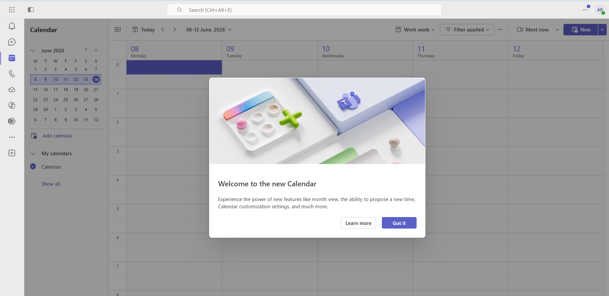
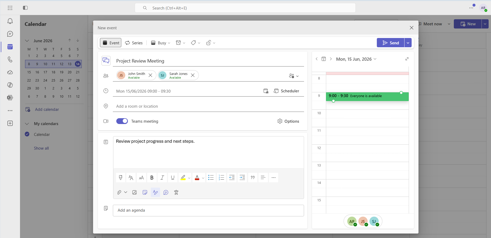
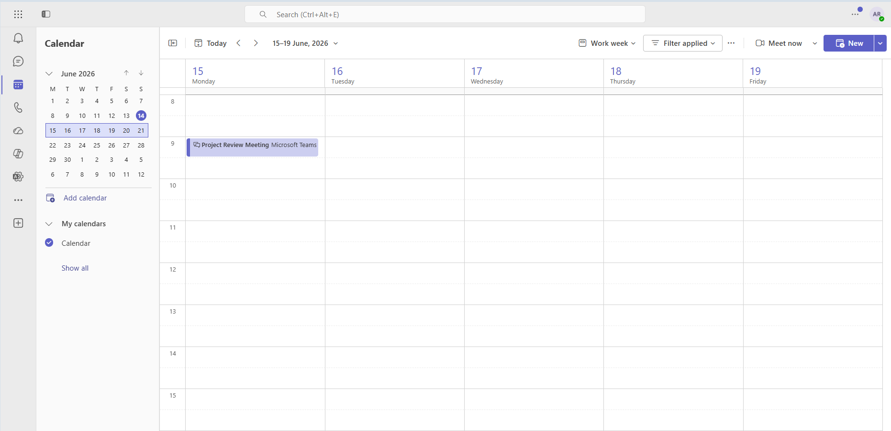

# Microsoft Teams

## Overview

This project demonstrates the administration and collaboration capabilities of Microsoft Teams within a Microsoft 365 environment. The exercise covered team management, channel creation, membership administration, collaboration settings, file sharing, meeting scheduling, and integration with SharePoint Online.

## Objectives

- Create and manage Microsoft Teams resources
- Manage team membership
- Create and manage channels
- Post and manage team conversations
- Share files within Teams
- Review collaboration settings
- Schedule and manage meetings
- Understand Teams integration with SharePoint Online

---

## Accessing Microsoft Teams

Microsoft Teams was accessed through the Microsoft 365 App Launcher.

### Navigation

1. Open Microsoft 365.
2. Click the App Launcher (9 dots).
3. Select **Microsoft Teams**.

### Observation

Microsoft Teams provides a centralised platform for communication, collaboration, meetings, and file sharing within Microsoft 365.

---

## Team Overview

The existing Team named **TechLab** was used for this project.

The Team already contained:

- Administrator account
- John Smith
- Sarah Jones
- Manager account

This provided a realistic collaboration environment for testing Microsoft Teams features.

### Features Observed

- Team conversations
- Channel activity
- Team membership
- Team notifications
- Collaboration workspace

### Screenshot



---

## Team Membership Administration

Team membership was verified to ensure all users were available for collaboration.

### Members

- Administrator
- John Smith
- Sarah Jones
- Manager User

### Learning Point

Microsoft Teams membership is closely integrated with Microsoft 365 Groups, allowing consistent access across Teams, SharePoint, and Exchange Online.

---

## Channel Management

A new channel was created within the TechLab Team.

### Channel Configuration

| Setting | Value |
|----------|----------|
| Channel Name | Projects |
| Description | Project collaboration and document sharing |
| Privacy | Standard |

### Screenshot



---

## Channel Structure

After creation, the Team contained:

```text
TechLab
│
├── General
└── Projects
```

The Projects channel was successfully added and became available to all team members.

### Screenshot



---

## Team Collaboration

The Projects channel was used to demonstrate collaboration features.

A welcome message was posted:

```text
Welcome to the Projects channel.
This channel will be used for project collaboration and document sharing.
```

### Benefits

- Team communication
- Project discussions
- Centralised collaboration
- Activity tracking

### Screenshot



---

## File Sharing

The Shared section of the Projects channel was used to demonstrate document collaboration.

### Document Created

```text
Project-Plan.docx
```

### Sample Content

```text
Project Plan created for Microsoft Teams Project 6.
```

### Screenshot



### Learning Point

Files shared in Microsoft Teams are stored in SharePoint Online document libraries.

```text
Microsoft Teams
        ↓
     Shared
        ↓
SharePoint Online
```

This integration provides:

- Version history
- Document collaboration
- Cloud storage
- Permission management

---

## Team Management

The Manage Team interface was reviewed.

### Administrative Areas

- Channels
- Members
- Settings
- Analytics
- Apps
- Tags

### Channel Review

The Team contained:

- General
- Projects

### Screenshot



### Learning Point

The Manage Team interface provides a central location for Team administration and configuration.

---

## Collaboration Settings

The Team Settings section was reviewed.

### Available Configuration Areas

#### Team Details

Allows administrators to:

- Modify team name
- Change team description
- Configure privacy settings
- Update team picture

#### Member Permissions

Controls whether members can:

- Create channels
- Add applications
- Manage resources

#### Guest Permissions

Controls actions available to guest users.

#### @Mentions

Controls:

- Team mentions
- Channel mentions
- Notification behaviour

#### Team Code

Provides a code that allows users to join the Team directly.

#### Fun Stuff

Controls:

- GIFs
- Memes
- Stickers

#### Tags

Supports user grouping and notification management.

### Screenshot



---

## Microsoft Teams Calendar

The Microsoft Teams Calendar was accessed through the left navigation menu.

The environment displayed the new Teams Calendar experience used for meeting scheduling and calendar management.

### Screenshot



---

## Meeting Management

A Teams meeting was scheduled to demonstrate calendar and meeting administration.

### Meeting Details

| Setting | Value |
|----------|----------|
| Title | Project Review Meeting |
| Attendees | John Smith, Sarah Jones |
| Location | Microsoft Teams Meeting |
| Purpose | Review project progress and next steps |

### Screenshot



---

## Meeting Scheduling

The meeting was successfully created and added to the Teams calendar.

### Features Demonstrated

- Meeting scheduling
- Attendee management
- Teams meeting creation
- Calendar integration
- Agenda planning

### Screenshot



---

## Troubleshooting and Observations

### Hidden Team Options

The Team administration menu was not immediately visible.

Administrative options only appeared when hovering the mouse pointer over the Team name.

### Learning Point

Many Microsoft Teams administrative controls remain hidden until the Team name is selected or hovered over.

---

### Teams Interface Differences

The environment used newer Teams terminology.

Instead of:

```text
Files
```

the interface displayed:

```text
Shared
```

for channel document access.

### Learning Point

Microsoft frequently updates the Teams interface, so administrators should focus on functionality rather than exact menu names.

---

## Skills Demonstrated

- Microsoft Teams administration
- Team management
- Membership administration
- Channel creation
- Channel management
- Team collaboration
- Conversation management
- File sharing
- SharePoint integration
- Collaboration settings management
- Meeting scheduling
- Calendar management
- Troubleshooting and problem solving

---

## Screenshots

- `teams-overview.png`
- `create-channel.png`
- `channel-created.png`
- `post-message.png`
- `file-shared.png`
- `manage-team.png`
- `team-settings.png`
- `calendar-overview.png`
- `meeting-details.png`
- `meeting-created.png`

---

## Conclusion

This project demonstrated the administration and collaboration capabilities of Microsoft Teams within Microsoft 365. Activities included channel creation, team management, membership administration, file sharing, collaboration settings review, meeting scheduling, and Teams integration with SharePoint Online. The exercise provided practical experience with one of the most widely used collaboration platforms in modern enterprise environments.
