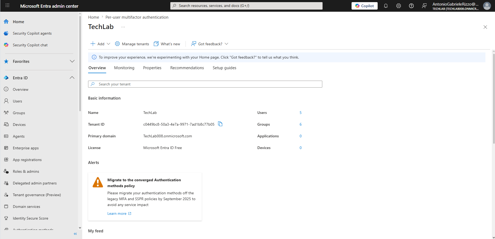
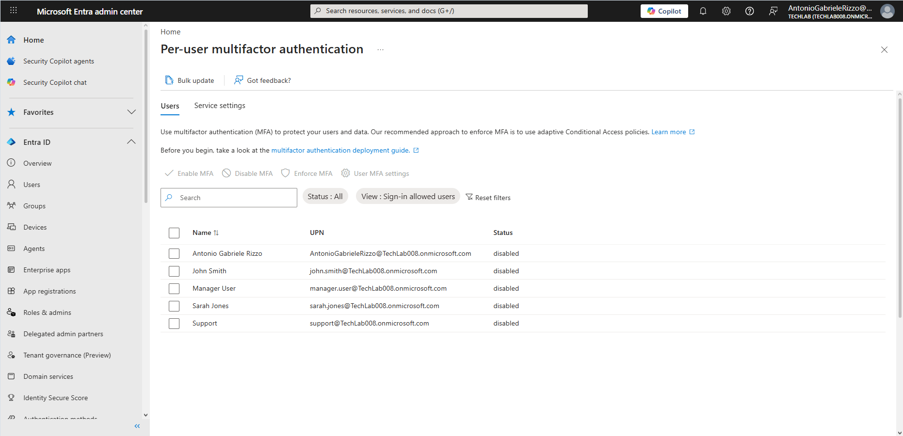
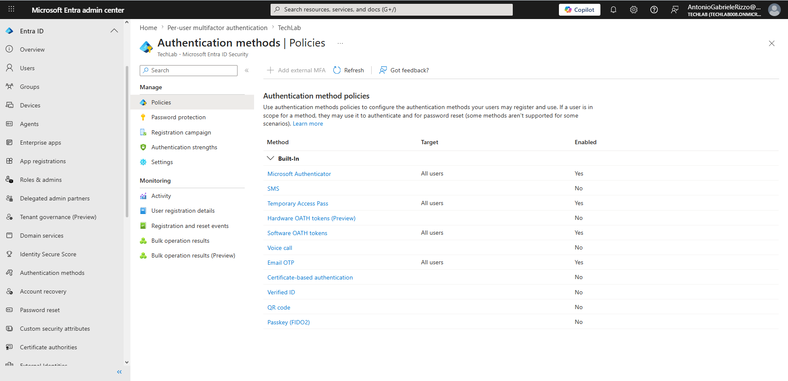
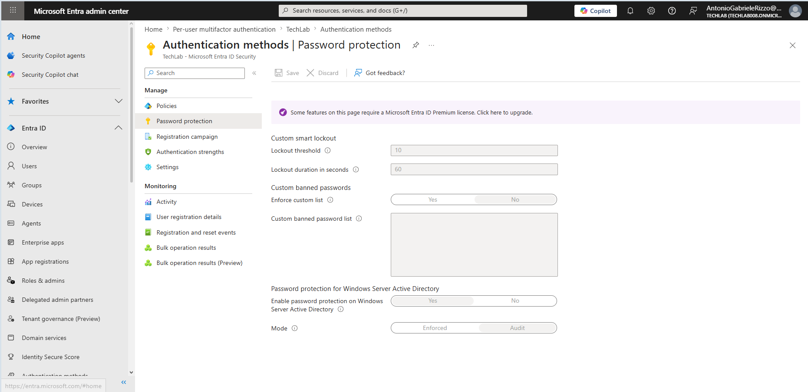
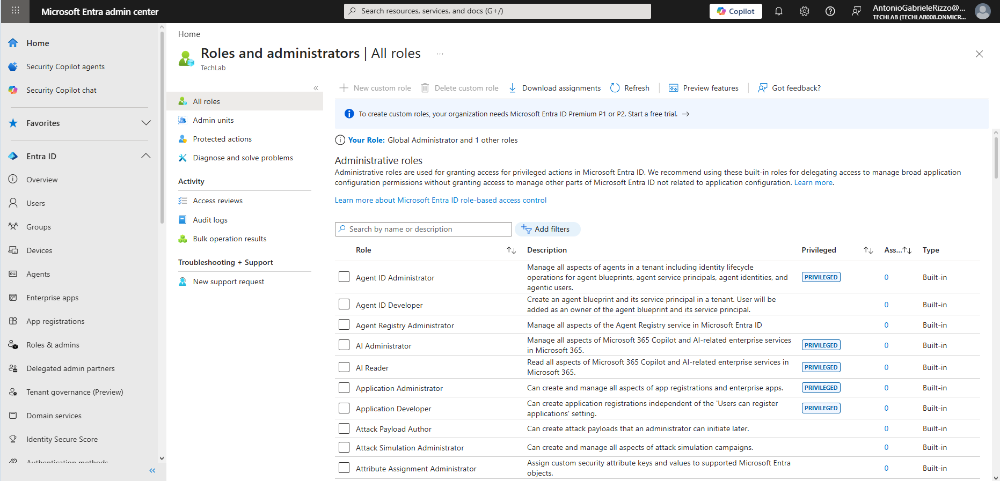
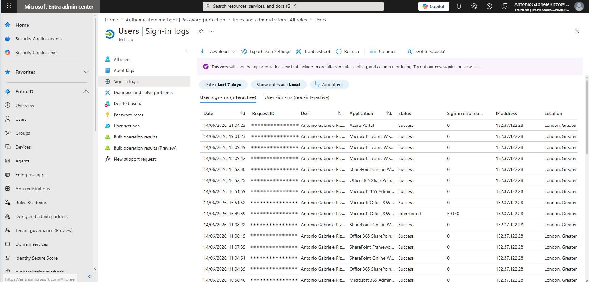
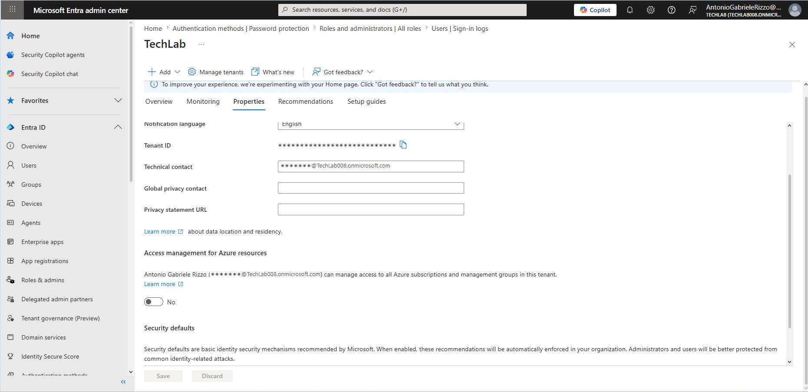

# Security

## Overview

This project demonstrates Microsoft 365 security and identity management using Microsoft Entra ID (formerly Azure Active Directory). The exercise focused on multifactor authentication (MFA), authentication methods, password protection, sign-in monitoring, administrative roles, and Security Defaults.

## Objectives

- Review Multifactor Authentication (MFA) settings
- Examine Authentication Method Policies
- Review Password Protection settings
- Monitor user sign-in activity
- Explore Administrative Roles
- Review Security Defaults
- Understand Microsoft Entra ID security capabilities

---

## Microsoft Entra Admin Center

Microsoft Entra Admin Center was used as the primary portal for identity and security management.

### Navigation

1. Open Microsoft Entra Admin Center.
2. Review tenant information.
3. Access identity, authentication, and monitoring features.

### Features Available

- Users
- Groups
- Devices
- Enterprise Applications
- Roles & Administrators
- Authentication Methods
- Identity Secure Score
- Monitoring Tools

### Screenshot



---

## Multifactor Authentication (MFA)

Multifactor Authentication was reviewed through the Per-User MFA administration interface.

### Navigation

```text
Users
→ Active Users
→ User Account
→ Multi-Factor Authentication
```

The MFA administration portal displayed all tenant users and their current MFA status.

### Observation

The user account John Smith displayed:

```text
MFA Status: Disabled
```

### MFA Status Types

| Status | Description |
|----------|----------|
| Disabled | MFA not configured |
| Enabled | MFA available but registration may be pending |
| Enforced | MFA required during sign-in |

### Screenshot



### Learning Point

Microsoft now recommends using Conditional Access and Authentication Method Policies rather than relying exclusively on legacy Per-User MFA.

---

## Authentication Method Policies

Authentication Methods were reviewed through Microsoft Entra ID.

### Navigation

```text
Entra ID
→ Authentication Methods
→ Policies
```

The tenant supported multiple authentication methods.

### Configured Methods

| Authentication Method | Status |
|----------|----------|
| Microsoft Authenticator | Enabled |
| Temporary Access Pass | Enabled |
| Software OATH Tokens | Enabled |
| Email OTP | Enabled |
| SMS | Disabled |
| Voice Call | Disabled |
| Hardware OATH Tokens | Disabled |
| Passkey (FIDO2) | Disabled |

### Screenshot



### Learning Point

Authentication Method Policies define which authentication options users may register and use for sign-in and password recovery.

---

## Password Protection Policies

Password Protection settings were reviewed through Microsoft Entra Authentication Methods.

### Navigation

```text
Authentication Methods
→ Password Protection
```

### Security Controls Observed

#### Smart Lockout

Current configuration:

```text
Lockout Threshold: 10
Lockout Duration: 60 Seconds
```

These settings help protect against brute-force password attacks.

#### Custom Banned Passwords

The tenant supports:

- Custom banned password lists
- Weak password prevention
- Password protection policies

#### Active Directory Integration

Password Protection settings also include options for:

```text
Windows Server Active Directory
```

This allows organisations to extend password protection to on-premises Active Directory environments.

### Screenshot



### Licensing Observation

The page displayed a notification indicating that some advanced Password Protection features require Microsoft Entra ID Premium licensing.

### Learning Point

Microsoft Entra ID Free provides basic security functionality while advanced password protection features require additional licensing.

---

## Administrative Roles

Role-Based Access Control (RBAC) was reviewed through Microsoft Entra ID.

### Navigation

```text
Entra ID
→ Roles & Administrators
```

Administrative roles allow organisations to delegate permissions without granting unrestricted access to the entire tenant.

### Roles Observed

Examples included:

- Agent ID Administrator
- AI Administrator
- Application Administrator
- Application Developer
- Attack Simulation Administrator

### Observation

The account used for administration displayed:

```text
Global Administrator
```

permissions.

### Screenshot



### Learning Point

Role-Based Access Control follows the Principle of Least Privilege by assigning only the permissions required for a specific administrative task.

---

## Sign-In Monitoring

Sign-In Monitoring was reviewed through Microsoft Entra ID.

### Navigation

```text
Entra ID
→ Users
→ Sign-In Logs
```

The Sign-In Logs interface provides visibility into authentication activity across the tenant.

### Information Available

- User account
- Application accessed
- Sign-in status
- Timestamp
- IP address
- Location
- Authentication details

### Screenshot



### Benefits

Sign-In Monitoring enables administrators to:

- Detect suspicious activity
- Review successful sign-ins
- Investigate authentication failures
- Support security auditing

---

## Security Defaults

Security Defaults were reviewed through the Entra ID tenant properties.

### Navigation

```text
Entra ID
→ Properties
→ Security Defaults
```

Security Defaults provide Microsoft-recommended baseline identity protection settings.

### Purpose

Security Defaults help protect against common identity-based attacks by enforcing modern authentication and security best practices.

### Benefits

- Improved account protection
- Reduced attack surface
- Modern authentication enforcement
- Security best practice adoption

### Screenshot



### Learning Point

Security Defaults provide a simple method for smaller organisations to improve security without deploying complex Conditional Access policies.

---

## Tenant Security Observations

During the exercise the tenant was identified as:

```text
Microsoft Entra ID Free
```

### Impact

Some advanced security features were unavailable because they require:

- Microsoft Entra ID Premium P1
- Microsoft Entra ID Premium P2

Despite these limitations, the tenant provided access to:

- MFA Administration
- Authentication Methods
- Password Protection
- Security Defaults
- Sign-In Monitoring
- Administrative Roles

---

## Troubleshooting and Observations

### MFA Administration Location

MFA management was accessed through:

```text
Users
→ Active Users
→ Multi-Factor Authentication
```

rather than through the main Entra navigation menu.

### Security Defaults Discovery

Security Defaults were not immediately visible through search.

The feature was eventually located through:

```text
Entra ID
→ Properties
→ Security Defaults
```

### Licensing Awareness

Several security features displayed licensing requirements.

This highlighted the importance of understanding Microsoft licensing when planning security deployments.

---

## Skills Demonstrated

- Microsoft Entra ID administration
- Identity management
- Multifactor Authentication administration
- Authentication Method Policy review
- Password Protection management
- Security monitoring
- Sign-In Log analysis
- Administrative Role management
- Security Defaults review
- Security troubleshooting
- Microsoft 365 security administration

---

## Conclusion

This project demonstrated core Microsoft 365 security and identity management capabilities using Microsoft Entra ID. Activities included reviewing Multifactor Authentication, Authentication Method Policies, Password Protection settings, Administrative Roles, Sign-In Monitoring, and Security Defaults. The exercise provided practical experience with identity security administration and reinforced the importance of layered security controls within Microsoft 365 environments.
