# PowerShell Administration

Microsoft 365 administration using PowerShell.

## Objectives

This project demonstrates the use of PowerShell for Microsoft 365 administration. The activities performed include installing and configuring Microsoft Graph PowerShell, connecting to Microsoft 365 services, running administrative commands, generating reports, automating repetitive tasks, and managing Exchange Online.

Topics covered:

- Microsoft Graph PowerShell
- Exchange Online PowerShell
- Basic administration commands
- Reporting commands
- Administrative automation

## Environment

- Microsoft 365 Business Basic trial tenant
- Windows 11
- Windows PowerShell 5.1
- Microsoft Graph PowerShell SDK 2.37.0
- ExchangeOnlineManagement 3.10.0

## Troubleshooting

During the installation of the Microsoft Graph PowerShell module, the installation process failed with a directory creation error.

### Issue Identified

```powershell
Install-Module Microsoft.Graph -Scope CurrentUser
```

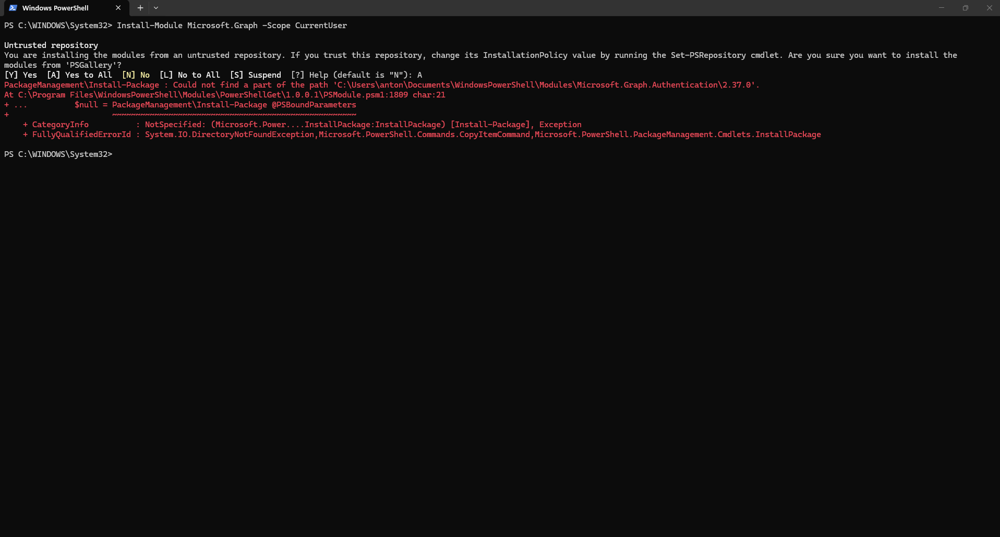

### Investigation

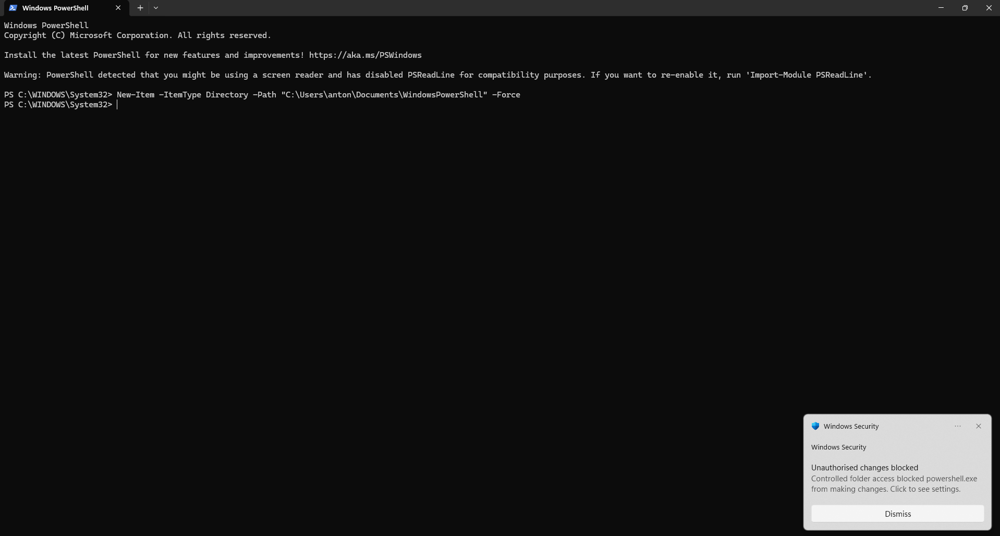

### Resolution

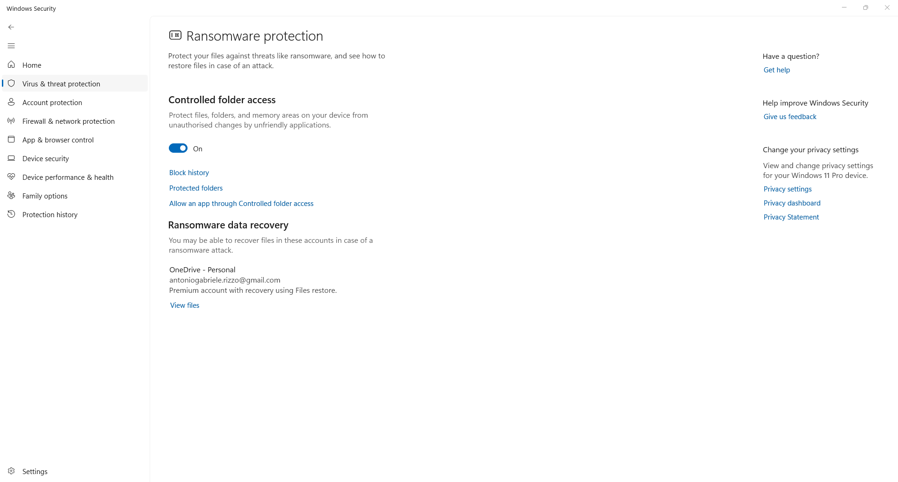

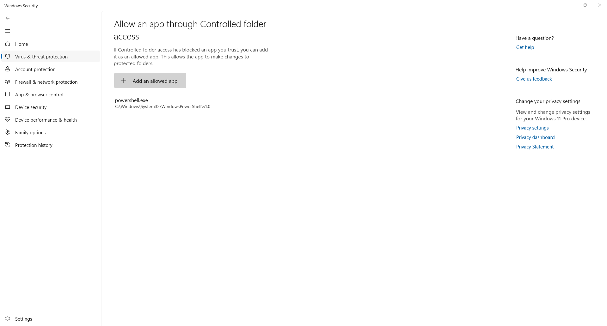

## Microsoft Graph PowerShell

### Installing Microsoft Graph

```powershell
Install-Module Microsoft.Graph -Scope CurrentUser
```

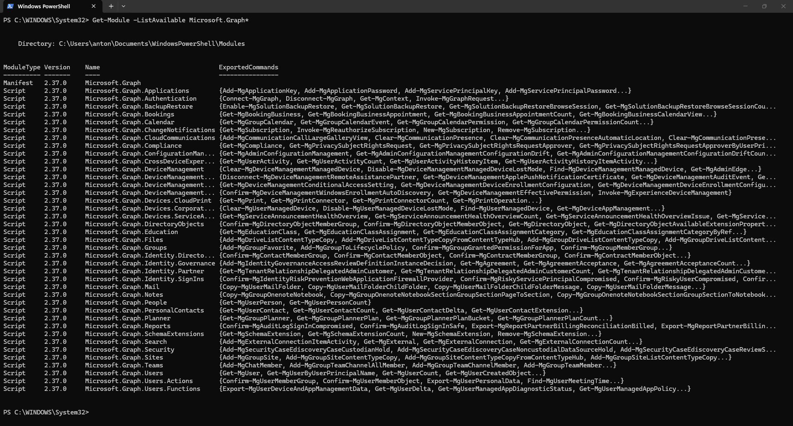

```powershell
Get-Module -ListAvailable Microsoft.Graph*
```

### Connecting to Microsoft Graph

```powershell
Connect-MgGraph -Scopes "User.Read.All","Directory.Read.All"
```

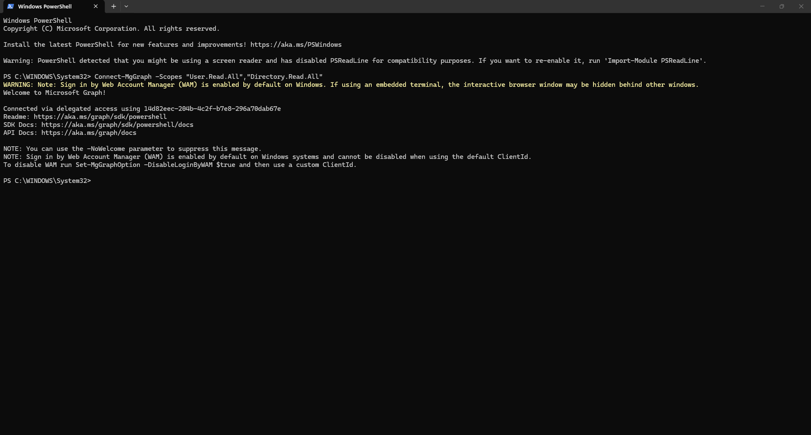

### Verifying the Connection

```powershell
Get-MgContext
```

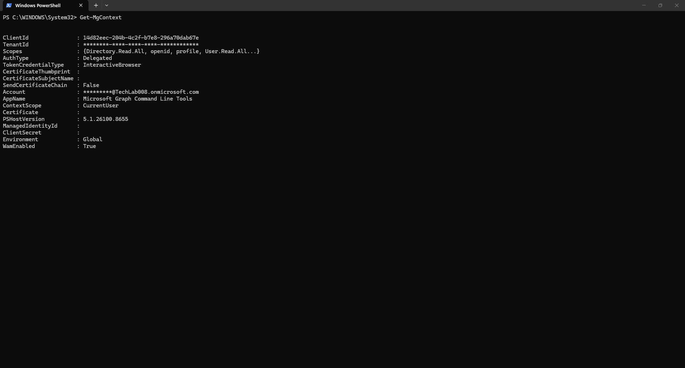

## Basic Administration Commands

```powershell
Get-MgUser
```

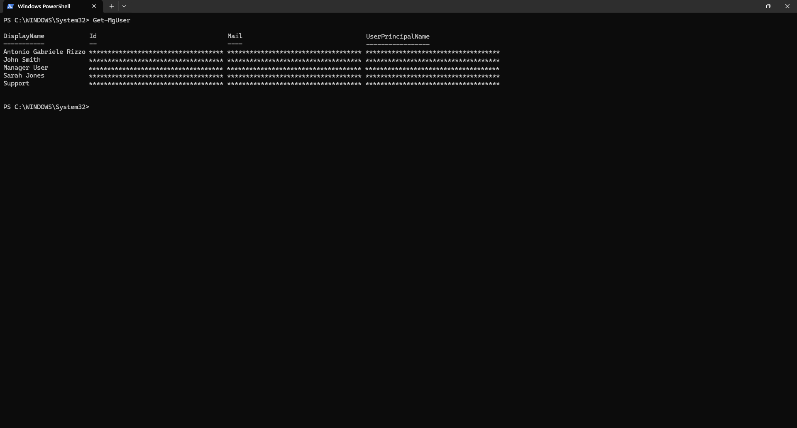

```powershell
Get-MgGroup
```

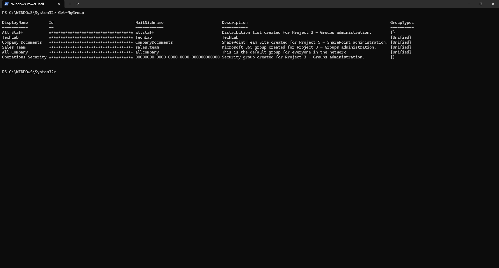

## Reporting Commands

```powershell
Get-MgUser -Property DisplayName,AccountEnabled |
Select DisplayName, AccountEnabled
```

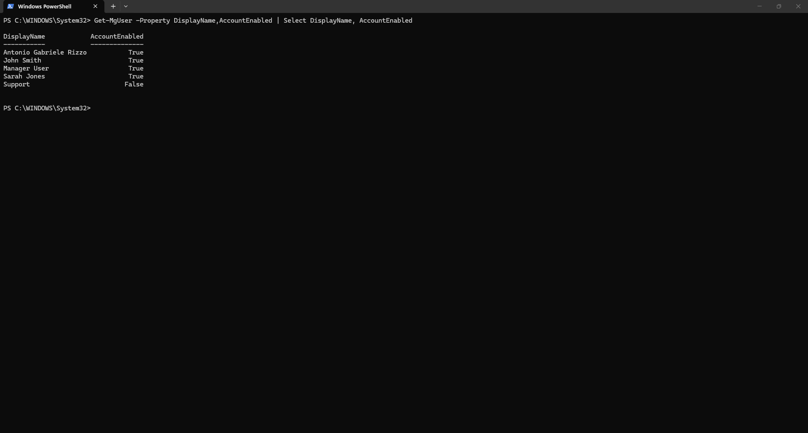

```powershell
Get-MgUser -Property DisplayName,AccountEnabled |
Select DisplayName, AccountEnabled |
Export-Csv "$HOME\Documents\UsersReport.csv" -NoTypeInformation
```

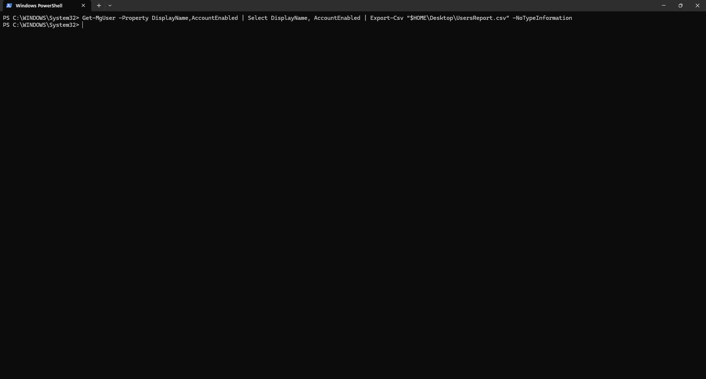

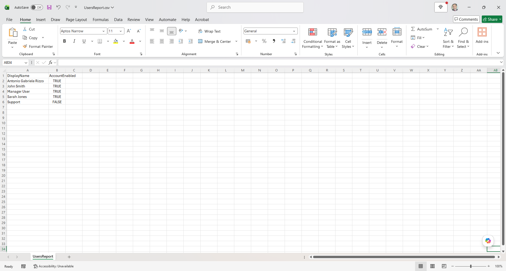

## Administrative Automation

```powershell
Get-MgUser -Property DisplayName,AccountEnabled |
Select DisplayName, AccountEnabled |
Export-Csv "$HOME\Documents\UsersReport.csv" -NoTypeInformation

Write-Host "User report exported successfully."
```

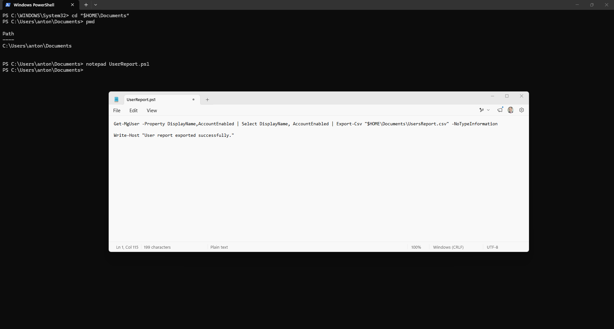

```powershell
.\UserReport.ps1
```


## Exchange Online PowerShell

```powershell
Install-Module ExchangeOnlineManagement -Scope CurrentUser
```

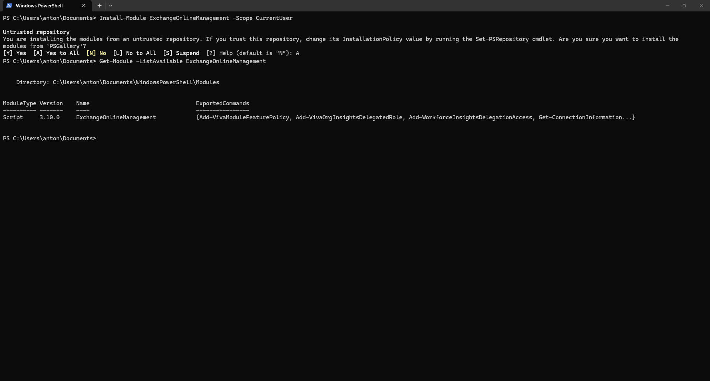

```powershell
Connect-ExchangeOnline
Get-ConnectionInformation
```

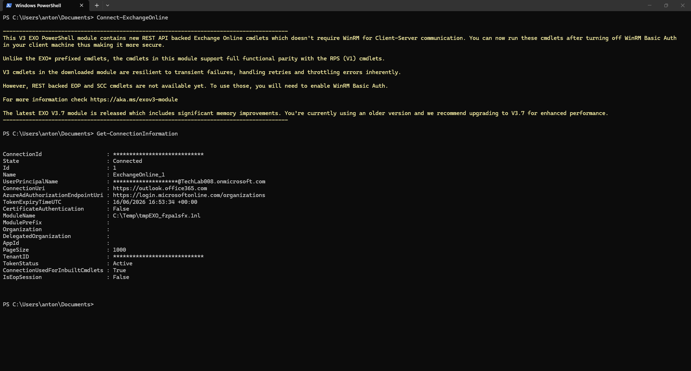

```powershell
Get-Mailbox | Select DisplayName, Alias, PrimarySmtpAddress
```

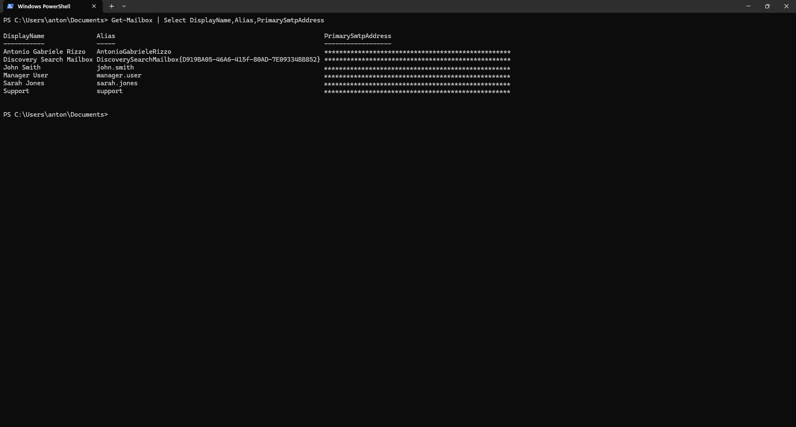

## Conclusion

This project demonstrated the use of PowerShell for Microsoft 365 administration using both Microsoft Graph PowerShell and Exchange Online PowerShell.
